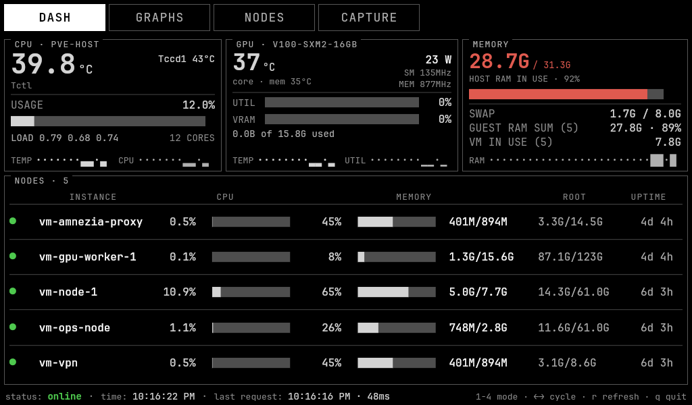
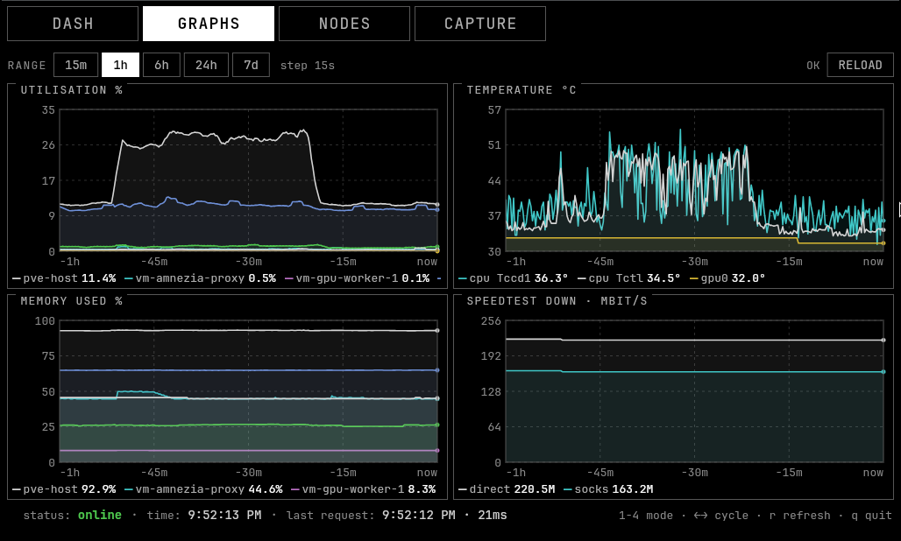
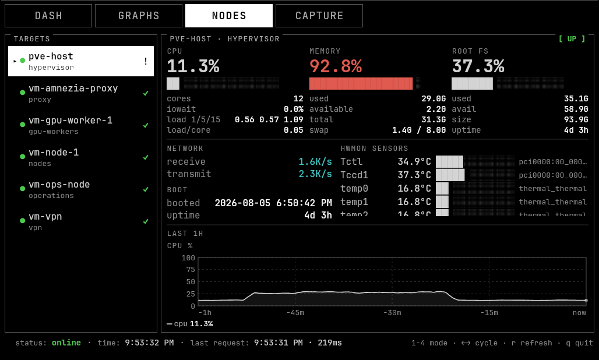
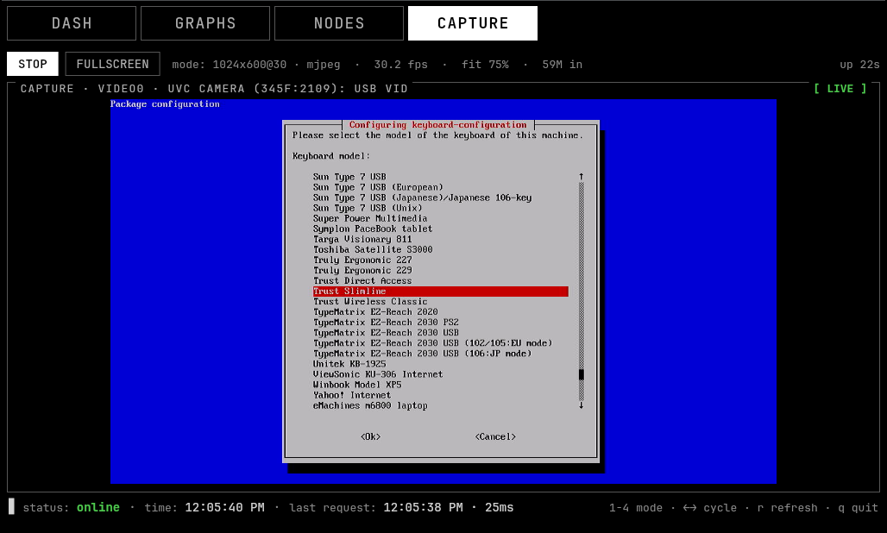

# 📟 Rackglass

[](https://flutter.dev/)
[](https://dart.dev/)
[](https://docs.flutter.dev/platform-integration/linux/building)
[](https://www.gtk.org/)
[](https://prometheus.io/)
[](https://www.proxmox.com/)
[](https://github.com/NVIDIA/dcgm-exporter)
[](https://ffmpeg.org/)
[](https://www.kernel.org/doc/html/latest/userspace-api/media/v4l/v4l2.html)
[](https://www.conventionalcommits.org/)
[](https://claude.com/claude-code)
[](https://github.com/NKTKLN/homelab)

**Rackglass** is a terminal-style Prometheus dashboard for a 7" 1024x600 panel
sitting on a desk next to the rack. Plain Linux console look: black background,
grey-white text, box-drawing frames, block-character bars. No phosphor tint, no
glow, no scanlines.

It is built against one real cluster — a Proxmox host (`pve-host`, 12 cores /
32 GiB) with four guests and a Tesla V100 behind dcgm-exporter — and the design
follows from that: an exporter on this cluster is down often enough that
*telling live numbers from remembered ones* is the feature, not an edge case.
That cluster, and the exporters this reads, are set up and documented in
[NKTKLN/homelab](https://github.com/NKTKLN/homelab).

The same panel also carries a live view from a USB HDMI capture card, so the
machine being monitored can be watched booting on the screen that monitors it.



## 📦 Dependencies

* [Flutter](https://docs.flutter.dev/get-started/install/linux) with Linux
  desktop support enabled
* [ffmpeg](https://ffmpeg.org/) — spawned as a child process for V4L2 capture
* Build toolchain: `clang`, `cmake`, `ninja`, `gtk3-devel`

Runtime services it reads:

* [Prometheus](https://prometheus.io/) — the only data source; nothing is
  scraped directly
* [node_exporter](https://github.com/prometheus/node_exporter) under
  `job="node"` — hypervisor and guests
* [dcgm-exporter](https://github.com/NVIDIA/dcgm-exporter) under `job="dcgm"` —
  GPU, may be down for days at a time
* a speedtest exporter publishing `speedtest_download_bits_per_second`

On Fedora:

```sh
sudo dnf install -y clang cmake ninja-build gtk3-devel ffmpeg
```

## 🖥 Screens

| Key | Mode | What's on it |
| --- | --- | --- |
| `1` | **DASH** | Host CPU package temp and named hwmon sensors, CPU usage, load; GPU temp/util/VRAM/power; host memory and swap with the guest-reported RAM sum; one row per scrape target with CPU%, memory, sparklines, load, root fs, network, iowait, uptime |
| `2` | **GRAPHS** | Four range-query charts — CPU %, memory %, temperatures, speedtest download — over 15m / 1h / 6h / 24h / 7d |
| `3` | **NODES** | Master/detail per target: CPU, memory, root fs, network, boot time, a GPU section and hwmon list where the target has them, and separate CPU / memory / temperature / GPU history charts |
| `4` | **CAPTURE** | Live view from the USB capture card, letterboxed to fit: fullscreen, frame stats, and a no-signal banner for when the card streams black |

**GRAPHS** — range queries over a shared window. GPU keeps amber wherever it
appears, so it stays apart from the node series on a shared axis.



**NODES** — one target at a time, with the glyph in the list carrying the worst
of its CPU, memory, root fs and GPU rather than a single number.



**CAPTURE** — the HDMI input, letterboxed, with the frame counters that say
whether the stream is healthy.



Other keys:

* `←` `→` — cycle modes
* `r` — force a refresh
* `Esc` — leave fullscreen
* `q` — quit

Every tab and button is also a touch target sized for a finger on a 7" screen.
There is no title bar: mode buttons, link state and the clock share one row,
because the app name and the endpoint told you nothing you could act on and the
row they cost is worth more to the data. The endpoint lives in the diagnostics
line at the bottom, next to the poll time.

## 🔧 Build-time configuration

There is no settings screen — a kiosk panel has nobody in front of it to fill
one in. Configuration is a set of compile-time defines baked into the binary,
and the usual way to supply them is an env file:

```sh
cp config.env.example config.env
$EDITOR config.env

flutter run   -d linux           --dart-define-from-file=config.env
flutter build linux --release    --dart-define-from-file=config.env
```

`config.env` is gitignored, so your endpoint and your topology stay out of the
repository. Individual values can still be passed directly, and a
`--dart-define` wins over the same key in the file:

```sh
flutter run -d linux --dart-define=PROM_URL=http://10.0.0.5:9090
```

| Define | Default | What it is |
| --- | --- | --- |
| `PROM_URL` | `http://localhost:9090` | Prometheus base URL, no trailing slash |
| `NET_DEVICE_EXCLUDE` | `^(lo\|veth.*\|tap.*\|fwbr.*\|fwln.*\|fwpr.*\|vmbr.*\|docker.*\|br-.*\|virbr.*)$` | Interfaces kept out of network totals |
| `CAPTURE_W` | `1280` | Capture width requested from the card |
| `CAPTURE_H` | `720` | Capture height |
| `CAPTURE_FPS` | `30` | Capture frame rate |

The default endpoint points at localhost on purpose: an unconfigured build
should fail to connect in a way you notice, rather than quietly querying
whatever answers at an address left in the source by someone else.

The interface exclusion matters on a Proxmox host: without it the same
forwarded packet is counted on the physical NIC, the bridge and the tap device,
and the host appears to be moving three times the traffic it is.

Environment variables, read at launch rather than build:

* `RACKGLASS_FULLSCREEN` — any value except `0`, `false`, `no` or `off` drops the
  titlebar and goes fullscreen

## 🚀 Running

Development:

```sh
flutter run -d linux
```

On the panel:

```sh
flutter build linux --release
RACKGLASS_FULLSCREEN=1 ./build/linux/x64/release/bundle/rackglass
```

Without `RACKGLASS_FULLSCREEN` you get a normal 1024x600 window, which is the
exact panel size — what you see while developing is what lands on the device.

## 🧪 Tests

```sh
flutter test
```

The widget tests drive the whole app against a fake Prometheus built from real
captured responses — including the down `vm-gpu-worker-1` target — and load the
bundled JetBrains Mono so layout assertions measure the true 0.6em advance
instead of `flutter_test`'s 1em stand-in font. A `RenderFlex` overflow at
1024x600 fails the suite.

There is also a live smoke test that checks every PromQL expression the UI
issues still returns usable data. It needs the server reachable, so it is off by
default:

```sh
flutter test test/live_smoke_test.dart --dart-define=RACKGLASS_LIVE=true --tags live
```

## 📐 Layout

The panel is roughly 170 DPI and gets read at arm's length, so nothing is set
below 13px and body text is 16px — a real console on this screen runs an 8x16
font, and that is the floor the scale in `theme.dart` is built around. Because
the type is large, screen density is a real constraint: panels carry a metric
per line rather than a stacked label-and-bar, and anything that did not fit
moved to NODES.

Everything is laid out against a fixed 1024x600 canvas and then scaled with a
`FittedBox`. The panel is pixel-perfect, larger windows get a proportionally
larger copy, and no arrangement of data can push a widget off screen.

Table columns are declared once as constants shared by the header and the rows,
so a column cannot be one width in the heading and another in the data.
Leftover row width is split evenly between column groups rather than pooling
into a single gap.

`test/overlap_test.dart` goes further: on every mode it collects the rect of
each visible `Text` and fails if any two share pixels. That is the failure mode
no overflow check catches — a panel title sitting on the first row of content, a
label with no room to ellipsize — and it looks broken on the panel while every
other test stays green.

## 🎥 USB capture

The card on this desk (MACROSILICON `345f:2109`) exposes MJPG natively, so
ffmpeg runs as a pure stream copy — nothing is decoded, scaled or re-encoded in
the child process — and the app splits the concatenated JPEGs itself and hands
each to Skia. Measured on the real device: ~1% CPU for the child at 1280x720@30.

The geometry is fixed rather than pickable. A 16:9 source letterboxes into
1024x576 on this panel, so 720 sits just above what the screen can show and
downscales cleanly; 1080p costs three times the bandwidth and decode for detail
the panel cannot display. Measured on the card, every mode holds its full rate:

| Mode | fps | Stream | Frame |
| --- | --- | --- | --- |
| 1920x1080@60 | 60.2 | 5.89 MB/s | 95 KB |
| 1920x1080@30 | 30.2 | 2.96 MB/s | 95 KB |
| 1280x720@30 | 30.2 | 1.33 MB/s | 42 KB |
| 800x600@30 | 30.2 | 0.70 MB/s | 22 KB |

The picture is letterboxed to fit and nothing else. The card scales the source
into whatever mode it is asked for, so a 1:1 view magnified the capture rather
than revealing more of the source — it never held detail the fitted view did
not.

Decoding keeps the newest frame and drops whatever arrived meanwhile; a queue
would only ever show progressively staler video. The stream runs while CAPTURE
is on screen and stops when it leaves, and every asynchronous step carries a
generation token so a late process exit or a decode finishing after a restart
cannot disturb the session that replaced it.

A capture card with nothing on its HDMI input streams valid black frames
forever, which is indistinguishable from a broken app, so the frame is
downscaled to 32x18 and averaged. The picture has to stay black for roughly
three seconds — 30 sampled frames — before the banner appears, since a fade or
one dark scene is not a lost signal, and the last good frame keeps showing
meanwhile. A returning source clears it with no hold at all.

## 📊 Handling missing data

This is most of the design. A dashboard that cannot tell a live reading from a
remembered one is worse than no dashboard, because you act on it.

**GPU metrics.** The exporter on this cluster is frequently down. Current DCGM
values are used while it is up, and `last_over_time(...[7d])` only while it is
down — so a single field vanishing from a healthy exporter renders `--` rather
than yesterday's number dressed as a reading. The seven-day scans are awaited
once, on the first poll that sees an exporter down, and refreshed in the
background from then on, so a slow TSDB scan never holds up node metrics that
are already in hand.

**Staleness age.** `timestamp()` loses the original sample time when it passes
through `last_over_time`, so the age needs its own expression — but a subquery
only evaluates on its own step boundaries, and its answer sawtooths from zero to
a full step. Measured against the live server it swung 0..300s while the true
age never passed 15s, which made a healthy GPU appear to drop out every few
minutes. A fresh series is therefore timed exactly with `time() - timestamp()`,
and the subquery is kept only for one that stopped long enough ago to fall out
of the lookback window, where minutes do not matter.

**Gaps stay gaps.** A failed poll or an absent target records a null sample, so
two readings either side of an outage are never drawn adjacent as though
monitoring had been continuous, and range charts break the line across a real
hole in the matrix instead of bridging it with a diagonal.

**Whole-snapshot staleness.** After 15 seconds without a successful poll the
dashboard dims and is marked `STALE`, rather than presenting the last good
values as current.

A stale GPU panel is drawn amber and badged `[ DOWN ]` with the age of its
readings. The same rule applies everywhere: a metric with no series renders
`--`, never `0`.

## 📁 Source layout

```
lib/src/
  config.dart              endpoint, poll interval, thresholds, design canvas
  theme.dart               palette and monospace text styles
  util.dart                bars, sparklines, byte/rate/duration formatting
  prom/prom_client.dart    Prometheus HTTP API v1 (instant + range)
  prom/queries.dart        every PromQL expression, in one place
  model/snapshot.dart      NodeStat / GpuStat / TempReading / Snapshot
  state/metrics_store.dart polling, history rings, range passthrough
  widgets/                 panel frame, gauges, chart painter, cursor
  capture/                 v4l2 capture: ffmpeg child, MJPEG framing, decode
  screens/                 dash, graphs, nodes, capture
```

## 🤖 Built with Claude Code

This project was written with [Claude Code](https://claude.com/claude-code),
Anthropic's agentic coding tool. The measured figures in this README — capture
bandwidth per mode, child-process CPU, the 0..300s staleness sawtooth — come
from running against the real hardware and the live Prometheus server rather
than from estimation.
